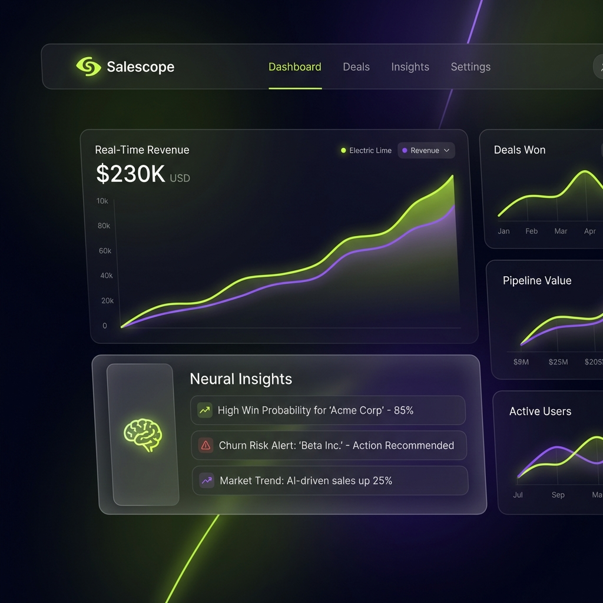

# 🛸 Salescope: Visualize your Sales Galaxy



**Salescope** is an enterprise-grade sales intelligence platform built for luminous clarity. It transforms fragmented sales data into cinematic, actionable insights using state-of-the-art web technologies.

## ✨ Features

- **Neural Dashboard**: A consolidated intelligence hub with real-time analytics and predictive pulse.
- **AI-Powered Predictions**: Forecast commercial trends with enterprise-grade machine learning models.
- **Smart Inventory Core**: Sophisticated asset ledger with automated stock lifecycle tracking.
- **Bespoke Glassmorphic UI**: Ultra-premium "Luminous Clarity" aesthetic with fluid Framer Motion transitions.
- **Bulletproof Security**: End-to-end encryption for sensitive financial and operational data.

## 🚀 Tech Stack

- **Framework**: [Next.js 16](https://nextjs.org/) (App Router)
- **Styling**: [Tailwind CSS 4](https://tailwindcss.com/) + [DaisyUI 5](https://daisyui.com/)
- **Animations**: [Framer Motion](https://www.framer.com/motion/)
- **Icons**: [Lucide React](https://lucide.dev/)
- **State & Auth**: [NextAuth.js](https://next-auth.js.org/)
- **Notifications**: [React Hot Toast](https://react-hot-toast.com/)

## 🛠️ Getting Started

### Prerequisites

- Node.js 18+
- npm / yarn / pnpm

### Installation

1. **Clone the repository:**

   ```bash
   git clone https://github.com/cristianpy09/salesscope-frontend.git
   cd salesscope-frontend
   ```

2. **Install dependencies:**

   ```bash
   npm install
   ```

3. **Configure Environment:**
   Create a `.env.local` file with your backend URL and Auth secrets.

4. **Run development server:**
   ```bash
   npm run dev
   ```

Open [http://localhost:3000](http://localhost:3000) to explore your Sales Galaxy.

## 🎨 Design Philosophy: "Luminous Clarity"

The Salescope V3 experience is defined by **Luminous Clarity**:

- **Glass-Panel System**: Semi-transparent surfaces with background blurs and 1px precision borders.
- **Electric Palette**: Deep midnight backgrounds paired with Electric Lime and vibrant accents.
- **Cinematic Motion**: Every interaction is guided by fluid, spring-based animations.

---

Built with ❤️ for the future of commercial operations.
